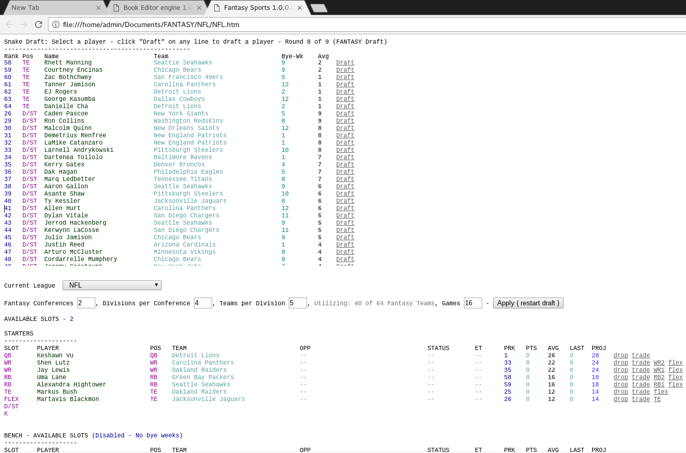
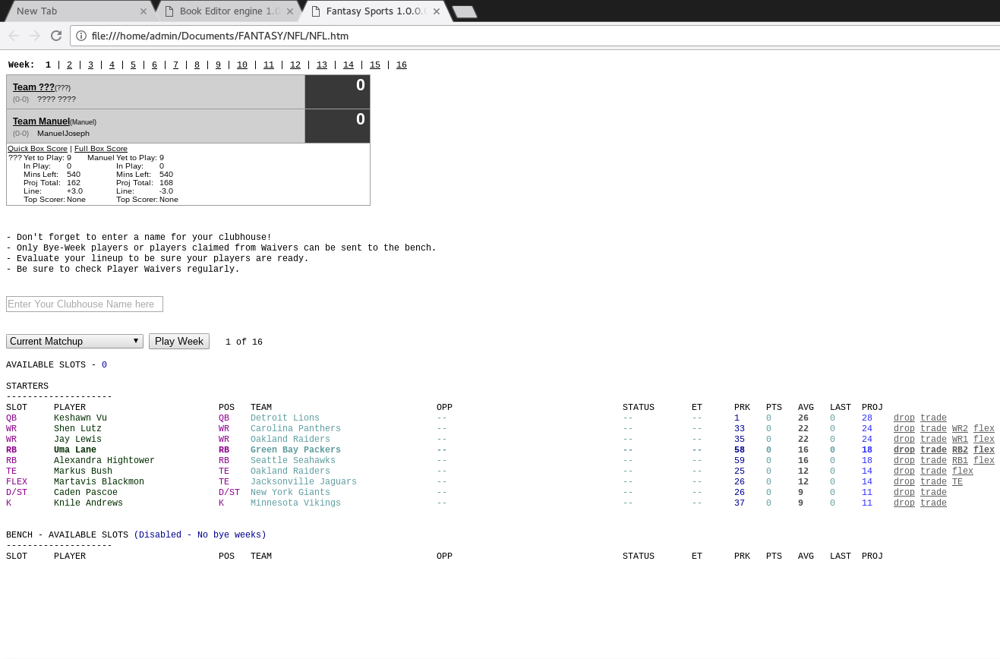
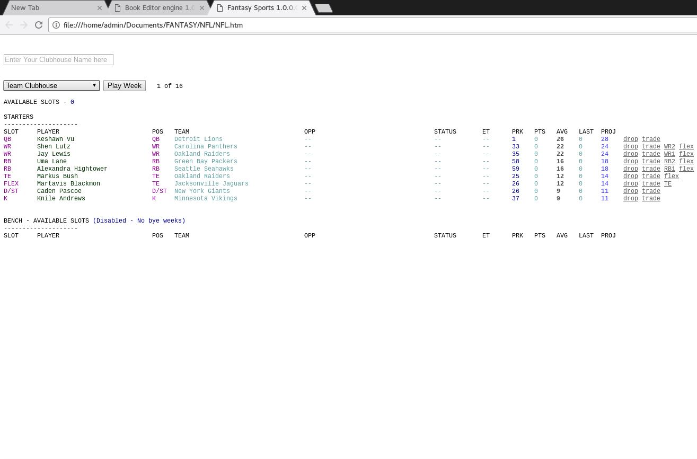
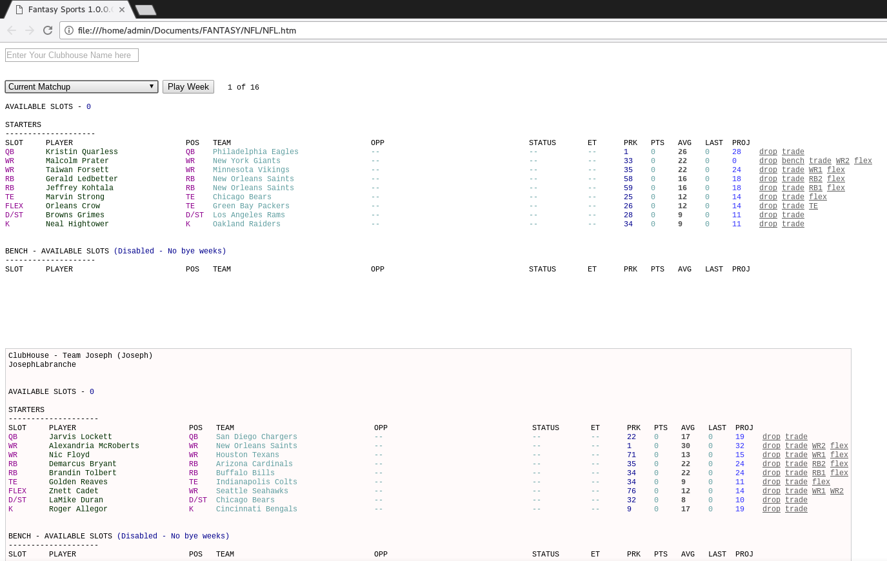
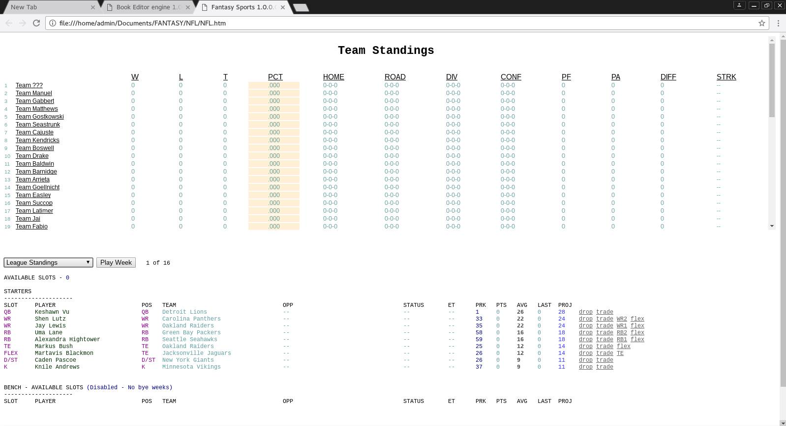
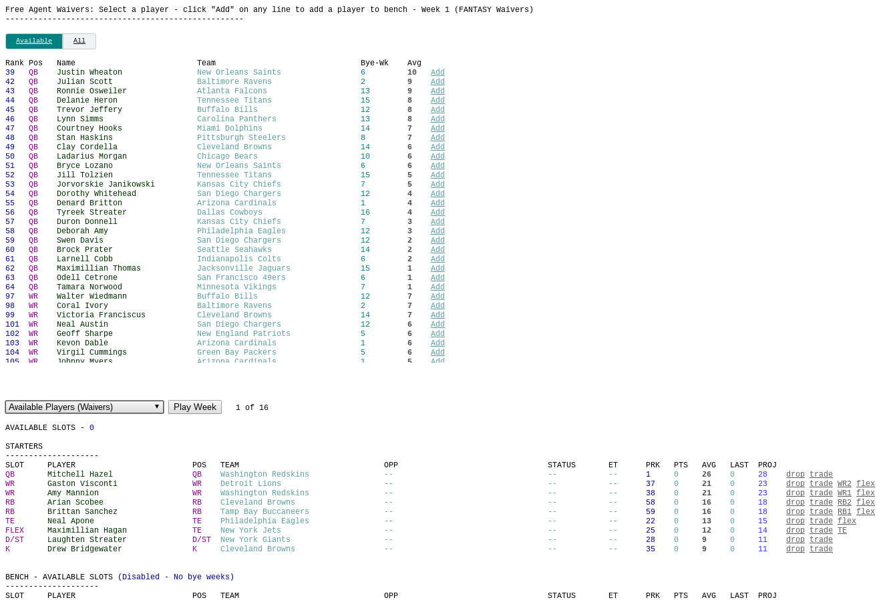
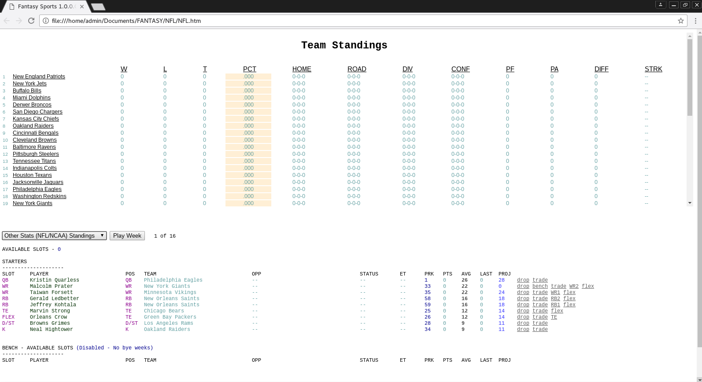
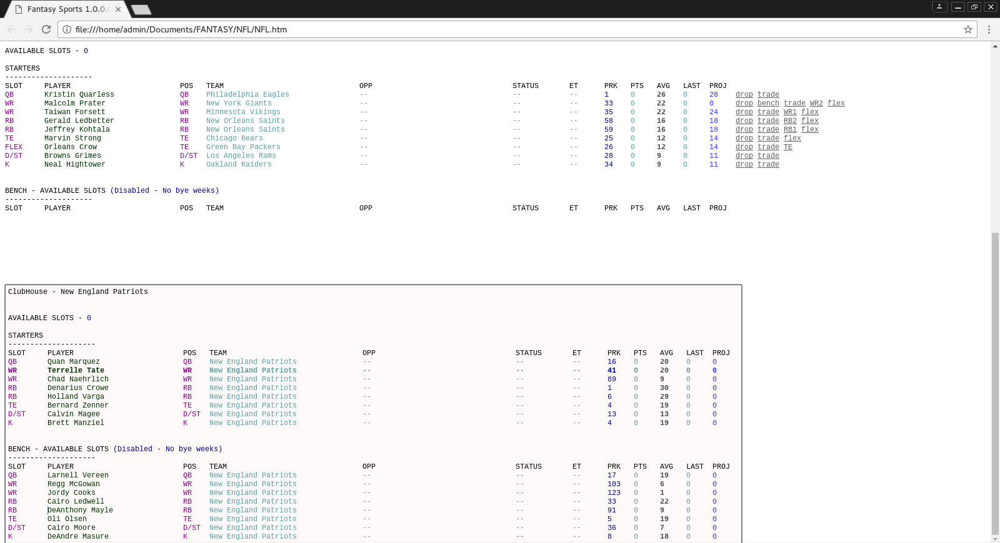

# Fantasy-Sports
A Fantasy Sports League Simulator written in HTML5,CSS3,and JavaScript.  
  
  
## Draft a team
  
  
  
## View Matchups  
  
  
  
## Sort lineup in team clubhouse  
  
  
  
## View Fantasy Opponent clubhouse   
  
  
  
## View Fantasy Team Standings  
  
  
  
## View Waivers  
  
  
    
## View Official League Standings   	
  
  
    
## View Official League Clubhouses    	
  
